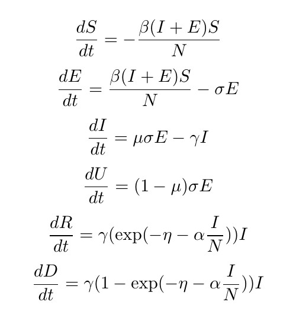

# CS145
Course Project of UCLA CS145

**Please create your own branch and upload your code to it.**

The SuEIR model (SuEIR.ipynb) achieves a score around 3.6. And I made a new model called SuEIRD (SueIRD.ipynb) based on SuEIR, which achieves a score around 2.8. (The code has been modified, so the score might be sligtly different than the score on Kaggle leaderboard)

The model has 6 variables: *S*: people susceptible to covid; *E*: people infected but have not been tested; *I*: reported active cases; *U*: unreported recovered; *R*: reported recovered; *D*: reported death.

The ODE described the model is

Notice that *I*+*R*+*D* is the reported confirmed case. Therefore during training, we optimize the MSE loss between predicted deaths and reported deaths, predicted confirmed cases and reported confirmed cases, predicted recovered and reported recovered, predicted active and reported recovered.
